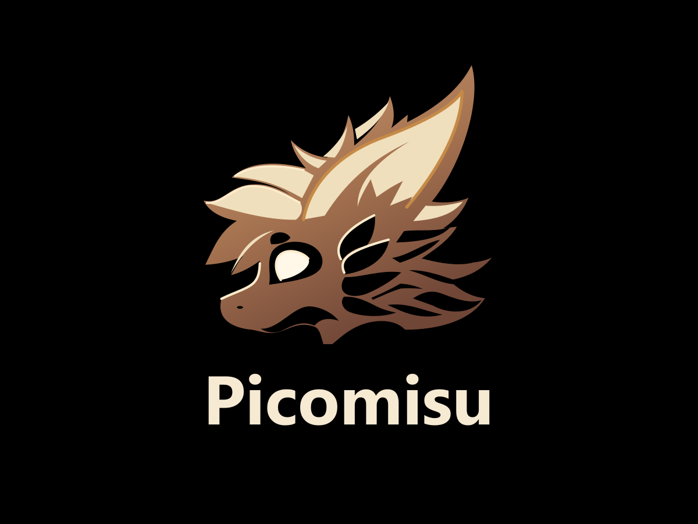

<p align="center"></p>

# Сборка Picomisu

Это руководство по сборке системного образа Picomisu из исходников. Установка в шлем
описана в [INSTALL.md](INSTALL.md).

## Содержание

- [Цели сборки](#цели-сборки)
- [Зависимости сборки](#зависимости-сборки)
- [Загрузка исходников](#загрузка-исходников)
- [Обновление дерева](#обновление-дерева)
- [Извлечение заводских файлов](#извлечение-заводских-файлов)
- [Окружение и выбор цели](#окружение-и-выбор-цели)
- [Воспроизводимые сборки](#воспроизводимые-сборки)
- [Сборка](#сборка)
- [Ключи подписи](#ключи-подписи)
- [Образ релиза](#образ-релиза)
- [Ограничения инструментов](#ограничения-инструментов)

## Цели сборки

| Устройство | Кодовое имя | Цель `lunch` | Статус |
|---|---|---|---|
| PICO 4 Pro | PICOA8110 | `aosp_pico4pro-userdebug` | основная, проверена на шлеме |
| PICO 4 Pro | PICOA8110 | `aosp_pico4pro-user` | собирается, на шлеме не проверялась |

Picomisu заменяет только `system`, `vbmeta_system` и `vbmeta`. Ядро, boot, vendor, odm
и product остаются заводскими (PICO OS **5.13.7**), поэтому образ совместим только с этой версией.

## Зависимости сборки

- Linux x86_64. Проверено на WSL2 с Ubuntu 24.04. Дерево должно лежать на ext4:
  NTFS (`/mnt/c`) не подходит.
- 32 ГБ ОЗУ или больше. Проверено на 45 ГБ.
- ~200 ГБ свободного места: исходники с `--depth=1` занимают ~60 ГБ, выход сборки ~100 ГБ,
  staging и образы ~20 ГБ.
- Стандартные зависимости сборки AOSP 10 и `git`, `python3`, `repo`.
- Для инструментов Picomisu: `python3-brotli`, `e2fsprogs` (`debugfs`), `rsync`.
  `bsdiff` нужен только для заводских файлов с патчем, сейчас таких нет.
- Для приватных репозиториев: доступ git к github.com/BearIvan
  (`gh auth login` и `gh auth setup-git`).

Старому Clang из prebuilts нужны `libncurses.so.5` и `libtinfo.so.5`, которых нет в Ubuntu 24.04.
Скрипт `picomisu/tools/prepare-host-compat.py` извлекает их из подписанных пакетов Ubuntu,
ничего не устанавливая в систему. Путь к ним передаётся в `PICOMISU_HOST_COMPAT`.

## Загрузка исходников

Ветка разработки — `main` манифеста. Форки CAF при этом синхронизируются на ветку `picomisu`.

```bash
mkdir picomisu-src
cd picomisu-src
repo init -u https://github.com/BearIvan/picomisu_manifest.git -b main --depth=1
repo sync -c -j8 --no-tags --no-clone-bundle --optimized-fetch
```

**Рекомендуем `--depth=1`**: история CodeLinaro для сборки не нужна и занимает десятки ГБ.
Стабильные релизы с зафиксированными хешами коммитов (`refs/tags/<версия>` манифеста) пока
не выпускаются.

Вместе с исходниками `repo` скачивает инструменты сборки образа и установки в `picomisu/`.
Отдельно клонировать ничего не нужно. Ссылка `picomisu/device` указывает на `device/` дерева,
а файл `.find-ignore` скрывает `picomisu/` от сборочной системы.

## Обновление дерева

```bash
repo sync -c -j8 --no-tags --no-clone-bundle --optimized-fetch
```

Чтобы переключиться на другую ревизию манифеста:

```bash
repo init -b REVISION
repo sync -c -j8 --no-tags --no-clone-bundle --optimized-fetch
```

## Извлечение заводских файлов

Заводские бинарники PICO в Git не хранятся. Для сборки нужны raw ext4-образы заводской
PICO OS 5.13.7 (SEKO): `system.img`, `product.img`, `vendor.img`, `odm.img`.

Их восстанавливает из официального полного OTA-архива
`5.13.7-202510301735-RELEASE-user-phoenix-b9665-42be801fae.zip`
(SHA-256 `00b2610888995558878a7d246996e38da51729011f45dd7ef114f9396aa6feba`)
скрипт `tools/extract-stock.py` из `picomisu`. Скрипт только читает архив и ничего не исполняет.

Затем из корня дерева исходников:

```bash
device/pico/PICOA8110/extract-files.py STOCK_DIR
```

Здесь `STOCK_DIR` — папка с образами. Скрипт извлекает 23 файла (список и SHA-256 в
`proprietary-files.json`):

- 10 JAR class path;
- 10 библиотек PICO/QTI;
- `libcryptfs_hw.so`;
- 3 XML-списка Smartisan.

Кроме того, он создаёт ссылки `stock/{vendor,product,odm}.img`. Файлы другой версии прошивки
будут отвергнуты по хешам.

Если заводской файл когда-нибудь потребуется изменить, в Git хранится бинарный патч
(поле `patch` в `proprietary-files.json`, применяется через `bspatch`), а не сам файл.

## Окружение и выбор цели

Скрипт `build/build-caf.sh` из `picomisu` готовит окружение, вызывает `lunch` и `make`.
Если нужно собрать вручную:

```bash
export SDCLANG=false SDCLANG_PATH=/nonexistent/sdclang SDCLANG_PATH_2=/nonexistent/sdclang
export ALLOW_MISSING_DEPENDENCIES=true SKIP_ABI_CHECKS=true
source build/envsetup.sh
lunch aosp_pico4pro-userdebug
```

Зачем нужны эти переменные:

- `SDCLANG_PATH` CAF требует даже тогда, когда закрытый Snapdragon LLVM выключен.
- `ALLOW_MISSING_DEPENDENCIES` нужен для открытых vendor-модулей QTI, которые ссылаются
  на закрытые библиотеки. В system они не входят, а system-модуль с недостающей зависимостью
  всё равно упадёт.
- `SKIP_ABI_CHECKS` действует, пока эталоны ABI не пересобраны для CAF.

Используйте `make` из CAF envsetup, а не `m`: он сначала собирает hidl-gen и генерирует
`Android.bp` для QTI HIDL.

## Воспроизводимые сборки

Номер и время сборки фиксируются переменными `BUILD_NUMBER` и `BUILD_DATETIME`.
По умолчанию `build-caf.sh` ставит значения текущих релизов:
`PICO_CAF_10_BRINGUP_2026100101` и `1790603988`.

## Сборка

```bash
PICOMISU_HOST_COMPAT=HOST_COMPAT_LIB_DIR picomisu/build/build-caf.sh
```

По умолчанию собирается цель `systemimage`; другие цели передаются аргументами.
Переменные скрипта:

- `PICOMISU_VARIANT=user` — user-сборка;
- `OUT_DIR` — каталог выхода (по умолчанию `out/`);
- `JOBS` — число потоков `make -j`, по умолчанию 8.

Хост-инструменты для сборки образа (`apksigner`, `aapt2`, `e2fsdroid`, `mke2fs`,
`img2simg`, `simg2img`, `zipalign`, `avbtool` и другие) собираются той же командой:

```bash
picomisu/build/build-caf.sh apksigner aapt2 e2fsck e2fsdroid img2simg mke2fs simg2img zipalign checkvintf avbtool signapk
```

## Ключи подписи

Заводские APK ролей platform, shared и media переподписываются ключами Source той же роли.
Путь к ключам задаётся в конфиге релиза (`signing.keys_dir`).

**Сейчас это публичные тестовые ключи AOSP** (`build/target/product/security`). Для
тестовых сборок это допустимо, для любой раздачи — нет: такими ключами может подписать
кто угодно. Переход на собственные ключи пока не сделан. Когда ключи появятся, **храните их
в безопасности и не теряйте**: обновление, подписанное другими ключами, на уже установленную
систему не встанет, потребуется полная установка со стиранием данных.

## Образ релиза

`system.img` из `out/` — ещё не прошивка. Образ для шлема собирает
`tools/assemble-source-image.py`:

- объединяет Source с заводскими APK (переподписанными нашими ключами), Bluetooth
  и службами PICO;
- генерирует build.prop, init.rc, ld.config и vintf из заводских файлов;
- собирает ext4 точно под размер заводского раздела system;
- подписывает AVB (`vbmeta_system`, `vbmeta`) и проверяет образ обратным чтением.

```bash
picomisu/build/assemble-release.sh VERSION BASE_VERSION
```

Например, `picomisu/build/assemble-release.sh 2.21 2.20` берёт конфиг
`device/pico/PICOA8110/source-2.21.json` и строит дельту от 2.20.
Результат: `outputs/source-VERSION/{system,vbmeta_system,vbmeta}.img` и `SHA256SUMS.txt`.

## Ограничения инструментов

Инструменты `picomisu` пока написаны под рабочее окружение автора, а не как универсальный
установщик:

- Пути зашиты в код:
  - проект `/mnt/wsl/PHYSICALDRIVE5p3/home/red_panda/RedPandaAndroid/pico4-pro`
    (дерево `source/caf-10`, выход `out/caf-10`);
  - Windows-часть `C:\Users\RedPanda\Documents\ChatGPT\Android\pico4-pro`;
  - adb из Android SDK пользователя.
- Нужны локальные данные, которые в Git не попадают:
  - снимок шлема (`tools/capture-baseline.py`);
  - LP-метаданные super (`tools/parse-lp-metadata.py`);
  - разобранное заводское system-дерево и отчёты (`tools/extract-vr-system.py`).

Перевод путей в переменные окружения — следующий шаг.
